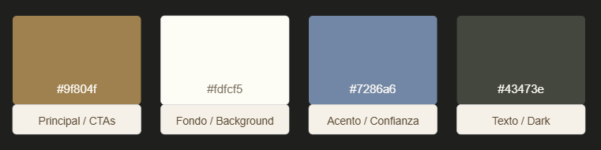

# Rannia Proyectos Modulares — Web Corporativa

Web corporativa de captación de leads para **Rannia Proyectos Modulares**, empresa especializada en la construcción de casas modulares de alta calidad en España.

## Descripción del proyecto

Landing page diseñada para presentar los proyectos realizados, transmitir los valores de la empresa y convertir visitas en contactos cualificados. Incluye galería de proyectos con modal interactivo, formulario de contacto con validación y notificaciones por email, y página de política de privacidad.

## Stack tecnológico

- **Framework:** Next.js (App Router) + React + TypeScript
- **Estilos:** Tailwind CSS v4 — tokens definidos en `globals.css` con `@theme {}`
- **Base de datos:** Supabase — tabla `leads` con Row Level Security
- **Email:** Resend — notificaciones de nuevos leads al email de la empresa
- **Fuentes:** Manrope (títulos) + Work Sans (cuerpo) via `next/font/google`

## Estructura principal

```
src/
├── app/
│   ├── layout.tsx               # Root layout, metadata SEO, fuentes
│   ├── page.tsx                 # Single page, ensambla secciones
│   ├── globals.css              # Tailwind v4 + tokens de marca
│   ├── api/contact/route.ts     # POST: guarda lead en Supabase + email Resend
│   └── politica-de-privacidad/  # Página RGPD
├── components/
│   ├── Navbar.tsx
│   ├── Hero.tsx
│   ├── About.tsx
│   ├── CasasTypes.tsx
│   ├── Gallery.tsx
│   ├── ProjectModal.tsx
│   ├── ProjectGalleryGrid.tsx
│   ├── WhyUs.tsx
│   ├── ContactSection.tsx
│   ├── ContactForm.tsx
│   ├── Footer.tsx
│   └── RevealWrapper.tsx        # Animaciones de scroll con IntersectionObserver
supabase/
└── migrations/
    └── 001_create_leads_table.sql
```

## Colores de marca



## Despliegue

Recomendado en **Vercel**. Configurar las variables de entorno en el panel del proyecto antes del primer despliegue. Asegurarse de tener el dominio verificado en Resend para que los emails no caigan en spam.
